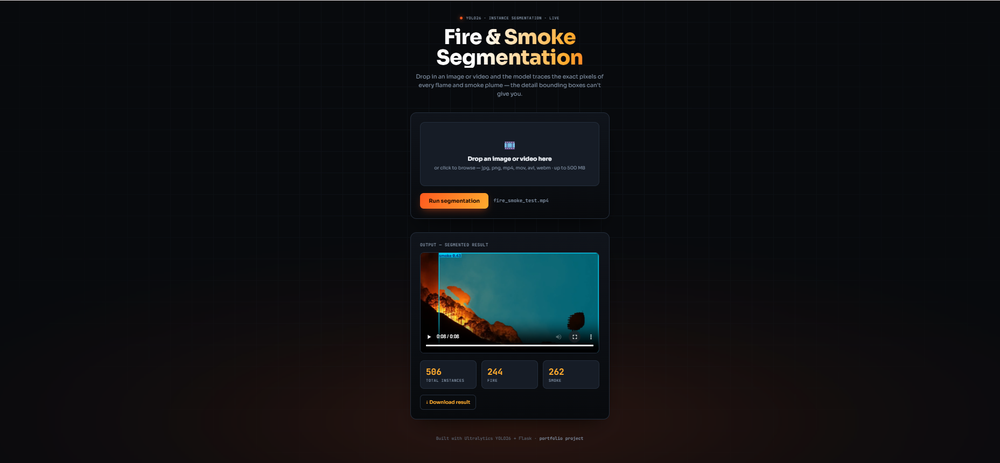

# 🔥 Fire & Smoke Segmentation (YOLO26)

Real-time **instance segmentation** of fire and smoke in images and video using a fine-tuned Ultralytics YOLO26 model, served through a Flask web app. It outlines the **exact pixels** of flames and smoke — not just bounding boxes — for precise monitoring and early-warning use cases.



🎥 **[Watch the demo video](https://drive.google.com/file/d/1oUrXqHDP8twUyYFvSnEG8gtojXZb2V2Y/view?usp=sharing)**

## Features
- Pixel-level masks for two classes: `fire` and `smoke`
- Works on both images and video
- Simple web interface — upload a file, get an annotated result
- Estimates the % of the frame that is on fire (possible because of masks)

## Tech stack
YOLO26-seg (Ultralytics) · Flask · PyTorch · OpenCV · HTML/CSS/JS

## Quickstart
```bash
git clone https://github.com/YOUR_USERNAME/fire-smoke-segmentation-yolo26.git
cd fire-smoke-segmentation-yolo26
pip install -r requirements.txt      # use Python 3.11 or 3.12
python app.py
```
Then open **http://127.0.0.1:5000**, upload an image or video, and view the result.

> Put your trained weights at `weights/best.pt`. For GPU: `pip install torch torchvision --index-url https://download.pytorch.org/whl/cu121`. Install **ffmpeg** for in-browser video playback.

## Applications
Wildfire monitoring · industrial fire safety · automated alert systems · CCTV/drone surveillance.

## Note
Fire and smoke have soft, irregular edges, so mask accuracy depends on training-data quality. This is a strong demo/proof of concept; safety-critical use needs a larger domain-specific dataset.

## License
MIT

**Author:** [Zainab Bibi] · [LinkedIn](https://www.linkedin.com/in/zainab-bibi-a177691b9/?skipRedirect=true)
